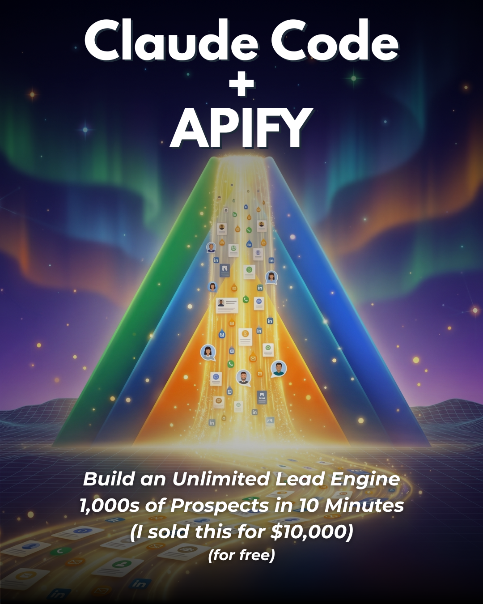

<div align="center">

# 🎠 Carousel Builder for Claude Code

**Build a fully branded Instagram carousel end-to-end without leaving your terminal.**



Higgsfield generates a theme-locked cover and middle images. Character budgets keep every line on-template. Canva assembles the deck by duplicating your template and swapping text + images in place. It finishes by writing the Instagram caption for you.

</div>

---

## What it does

`/carousel` runs an interview-first, approval-gated pipeline that turns one topic into a finished, on-brand carousel:

1. **Loads your framework** — reads a reference deck (shipped in `examples/template-reference/`) so it mirrors your exact layout: two-tone headlines, one orange highlight word, glow images, CAPS-word body lines.
2. **Interviews the idea** — breaks your topic into 4–6 pillars, each a single component doing one job, plus a CTA keyword + deliverable.
3. **Generates a cover (Higgsfield, 4:5)** — 3–4 options, no baked-in text. The one you pick becomes the **theme anchor** for everything else.
4. **Drafts the copy with live character counts** — every line is budget-checked against the real Canva text boxes *before* a single image credit is spent. You approve the draft first.
5. **Generates theme-locked pillar images (Higgsfield, 16:9)** — every middle image is passed the chosen cover as a reference so the whole deck shares one palette, lighting, and mood. No drift.
6. **Assembles the deck in Canva** — duplicates your template, replaces text span-by-span (preserving the orange highlight), and swaps images with `update_fill` so the frame glow survives. Nothing is committed until you approve the preview.
7. **Writes the caption** — automatically runs `/short-form-caption` so the post copy and the on-slide CTA keyword match.

### `/short-form-caption` (bundled, auto-invoked)

Ships in the same package. `/carousel` calls it as its final step, but it also works standalone on any video transcript or topic blurb. It produces a tight, copy-paste-ready IG/TikTok/Reels caption: CTA on line one, fragment rhythm, exactly 5 hashtags, 500-character hard cap, no em dashes, written in your voice via a fingerprint file.

> **Why character budgets?** The Canva text boxes are sized for specific lengths. Go over and the text reflows, the slide stops matching the deck, and the carousel loses its visual unity. Budgets are enforced on the draft so over-length copy never reaches Canva.

---

## Requirements

Two MCP servers, both connected in Claude Code:

| MCP | What it does | Get it |
|---|---|---|
| **Higgsfield MCP** | Image + video generation (cover + pillar images). Uses the `nano_banana_2` model. | **[Get Higgsfield MCP access →](https://higgsfield.ai/s/higgsfield-mcp-ig-charlieautomates-dBaWAw)** |
| **Canva MCP** | Duplicates your template and edits text + image fills in place. | Add `https://mcp.canva.com/mcp` as an `http` MCP server, then run `/mcp` and authenticate. |

You also need an 8-page Canva carousel template you own (see Setup below). A reference deck to recreate is included in `examples/template-reference/`.

---

## Install

### Option A — as a Claude Code plugin (recommended)

```
/plugin marketplace add charlesdove977/carousel-builder
/plugin install carousel-builder@carousel-builder
```

Restart Claude Code. `/carousel` and `/short-form-caption` are now available.

### Option B — manual

Copy the two command files into your commands directory:

```bash
git clone https://github.com/charlesdove977/carousel-builder.git
cp carousel-builder/commands/*.md ~/.claude/commands/        # global
# or, per-project:
cp carousel-builder/commands/*.md /path/to/project/.claude/commands/
```

### Option C — just point Claude at it

Paste this repo's URL into Claude Code and say *"install these commands for me."*

---

## Setup (one time)

Open `commands/carousel.md` and `commands/short-form-caption.md` and replace the placeholders:

| Placeholder | Set it to |
|---|---|
| `<YOUR_CANVA_TEMPLATE_ID>` | The design ID of **your** 8-page Canva carousel template. Recreate the layout in `examples/template-reference/` (8 PNGs) inside Canva, then copy its design ID. The template and the example folder must match 1:1. |
| `<YOUR_BRAND_VOICE_FILE>` | Path to your brand context file. Start from `config/brand-context.example.md`. |
| `<YOUR_HANDLE>` | Your Instagram handle for the closer slide. |
| `<YOUR_VOICE_FILE>` | Path to your voice fingerprint for captions. Start from `config/voice-fingerprint.example.md`. |

Then customize the fallback CTA table in `short-form-caption.md` with your own lead magnets.

---

## Usage

```
/carousel Claude Code + Apify for unlimited leads
```

Or run it bare and it'll interview you:

```
/carousel
```

Output lands in `content/carousels/{topic-slug}/`:

```
content/carousels/{topic-slug}/
├── {topic-slug}.md        ← slide copy + char counts + image prompts + caption
├── cover/                 ← 4:5 cover options + the chosen one
├── slides/                ← 16:9 pillar images
└── canva-link.md          ← new Canva edit + view URLs
```

Caption only, from a transcript:

```
/short-form-caption ./path/to/transcript.txt
```

---

## Template anatomy

| Page | Role | Editable parts |
|---|---|---|
| 1 | **Cover** | Higgsfield 4:5 image + optional Canva text overlay (two-tone headline + italic subtext). |
| 2…N+1 | **Pillars** (4–6) | Two-tone headline `The [Role]: [orange tool] [verb].` + a 16:9 glow image + dark body line ending in ONE ALL-CAPS word. |
| N+2 | **Gift / CTA** | `Comment {KEYWORD} and I'll send {deliverable}.` |
| N+3 | **Closer** | `SAVE / SHARE / FOLLOW` + your handle. Static. |

**Character budgets (hard caps):** pillar headline 45–58 chars (one orange word) · pillar body 65–80 chars (one CAPS word) · cover headline ≤ ~22 chars · cover subtext 3–4 short italic lines.

---

## Notes

- **Higgsfield is async.** `generate_image` returns a job; the command polls `job_status` with `sync: true`. If the Higgsfield MCP isn't connected at run time, the command stops and tells you — it never silently falls back to another generator.
- **The glow stays.** Pillar images are swapped with `update_fill` inside the existing Canva frame, so the frame's glow effect is preserved. Deleting and re-inserting loses it.
- **Nothing commits without approval.** Canva drafts are permanently lost if not committed, so the command shows you a preview and waits for explicit approval before committing the transaction.

---

## License

MIT © [Charles J Dove](https://charlieautomates.com) · [Charlie Automates](https://charlieautomates.com)

Built with Claude Code. More free Claude Code skills, plugins, and guides at **[charlieautomates.com/free-resources](https://charlieautomates.com/free-resources/)**.
